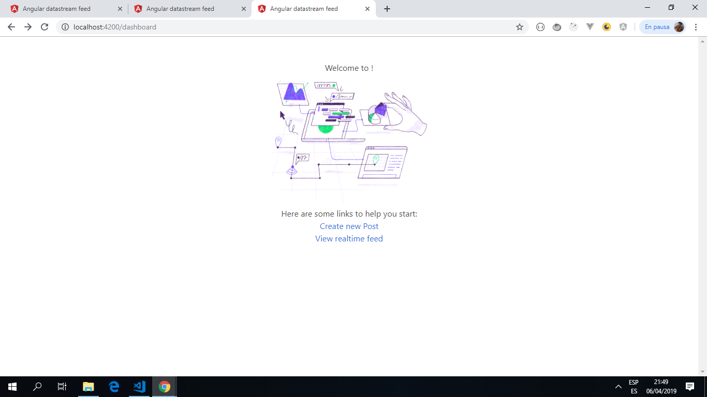
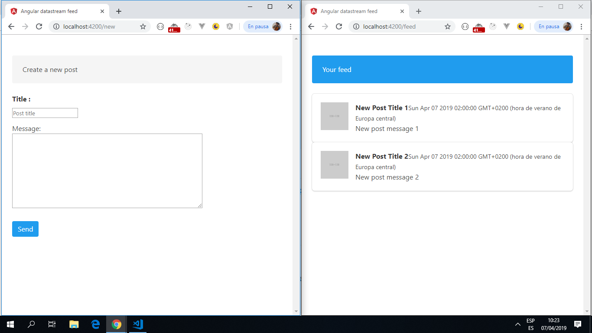

# Angular Datastream Feed

* Angular app that uses RxJS asynchronous code to show Reddit search results in HTML
* **Note:** to open web links in a new window use: _ctrl+click on link_


## Table of contents

* [Angular Datastream Feed](#angular-datastream-feed)
  * [Table of contents](#table-of-contents)
  * [General info](#general-info)
  * [Screenshots](#screenshots)
  * [Technologies](#technologies)
  * [Setup](#setup)
    * [Client setup](#client-setup)
  * [Code Examples](#code-examples)
  * [Features](#features)
  * [Status & To-Do List](#status--to-do-list)
  * [Inspiration](#inspiration)
  * [:file_folder: License](#file_folder-license)
  * [:envelope: Contact](#envelope-contact)

## General info

* Code from Angular Boot Camp tutorial (see Inspiration below) on correct use of RxJS

## Screenshots




## Technologies

* [Angular framework v14](https://angular.io/)
* [RxJS v7](https://rxjs.dev/) Reactive Extensions Library for JavaScript
* [reddit API documentation](https://www.reddit.com/dev/api/)

## Setup

### Client setup

* Install dependencies with npm install.
* Run app using `ng serve` then navigate to `http://localhost:4200/`.

## Code Examples

```typescript

```

## Features

* RxJS methods reduce wasted HTTP data transfers

## Status & To-Do List

* Status: Working
* To-Do: Correct types and activate strict mode.

## Inspiration

* [Oasis Digital: RxJS, the easy way to write correct Angular applications](https://www.youtube.com/watch?v=DAGrVyKR_P4),

## :file_folder: License

* This project is licensed under the terms of the MIT license.

## :envelope: Contact

* Repo created by [ABateman](https://github.com/AndrewJBateman), email: gomezbateman@yahoo.com
