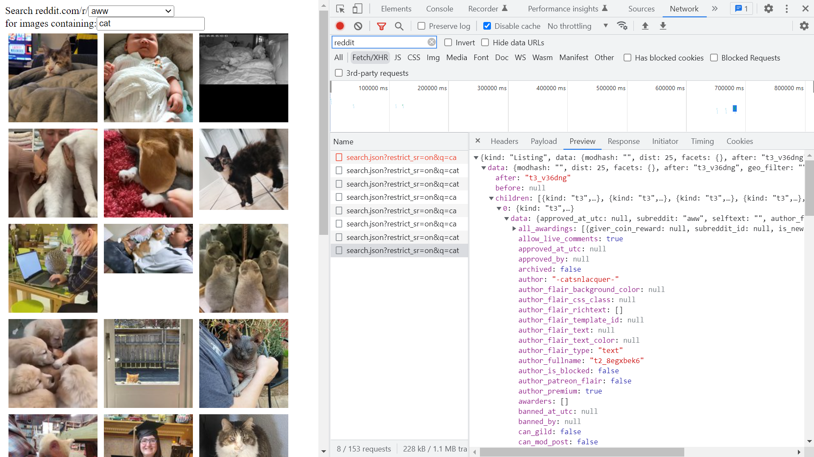

# :zap: Angular Datastream Feed

* Angular app that uses RxJS asynchronous code to show Reddit search results in HTML
* **Note:** to open web links in a new window use: _ctrl+click on link_


## :page_facing_up: Table of contents

* [:zap: Angular Datastream Feed](#zap-angular-datastream-feed)
  * [:page\_facing\_up: Table of contents](#page_facing_up-table-of-contents)
  * [:books: General info](#books-general-info)
  * [:camera: Screenshots](#camera-screenshots)
  * [:signal\_strength: Technologies](#signal_strength-technologies)
  * [:floppy\_disk: Setup](#floppy_disk-setup)
  * [:computer: Code Examples](#computer-code-examples)
  * [:cool: Features](#cool-features)
  * [:clipboard: Status \& To-Do List](#clipboard-status--to-do-list)
  * [:clap: Inspiration](#clap-inspiration)
  * [:file\_folder: License](#file_folder-license)
  * [:envelope: Contact](#envelope-contact)

## :books: General info

* Code from Angular Boot Camp tutorial (see Inspiration below) on correct use of RxJS

## :camera: Screenshots



## :signal_strength: Technologies

* [Angular framework v16](https://angular.io/)
* [RxJS v7](https://rxjs.dev/) Reactive Extensions Library for JavaScript
* [reddit API documentation](https://www.reddit.com/dev/api/)

## :floppy_disk: Setup

* Install dependencies with npm install.
* Run app using `ng serve` then navigate to `http://localhost:4200/`.

## :computer: Code Examples

* `reddit-search.component.ts` function using RxJS switchmap to combine 2 observable data streams and return a new observable

```typescript
    this.results = combineLatest([validSubReddit, validSearch]).pipe(
      // This logs the user's intended search
      tap(search => this.logger.log('Search for: ' + search)),
      // take an input observable, return a different observable
      switchMap(([subReddit, search]) =>
        ris.search(subReddit, search).pipe(
          retry(3),
          // Clear previous entries while waiting
          startWith([])
        )
      )
    );
```

## :cool: Features

* RxJS methods reduce unnecessary HTTP data requests

## :clipboard: Status & To-Do List

* Status: Working but with strict mode turned off
* To-Do: Correct types and reactivate strict mode.

## :clap: Inspiration

* [Oasis Digital: RxJS, the easy way to write correct Angular applications](https://www.youtube.com/watch?v=DAGrVyKR_P4),

## :file_folder: License

* This project is licensed under the terms of the MIT license.

## :envelope: Contact

* Repo created by [ABateman](https://github.com/AndrewJBateman), email: `gomezbateman@yahoo.com`
